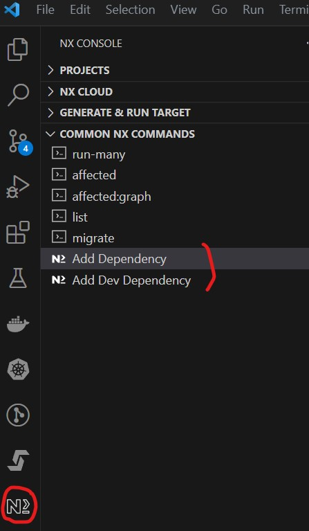

# Development Procedures, Practices, and Guidelines

This document contains information for MINE code development. If you're looking for general environment set up information, refer to the main [MINE repository README](../README.md).

**Table of Contents**

- [Package management](#package-management)
- [Running the linter](#running-the-linter)
- [Running unit tests](#running-unit-tests)
- [Building packages](#building-packages)
- [Adding a shared library](#adding-a-shared-library)
  - [Adding a shared library with Nx Console](#adding-a-shared-library-with-nx-console)
  - [Adding a shared library from the VSC console](#adding-a-shared-library-from-the-vsc-console)
- [VSC Snippets](#vsc-snippets)

---

## Package management

The easiest way to add new packages to the workspace is using the **Nx Console** add-in.

1. Open **Nx Console**
1. In the "COMMON NX COMMANDS" section, there are two items:
   - Add Dependency
   - Add Dev Dependency
1. Choose the appropriate command and specify the name of the NPM package to add.

> Note: The tool lists many packages which it has decided might be useful but you don't have to choose from that list. Just type the name of the package you want to add.



---

## Running the linter

From the repository _root_, you can run the code linter (ESLint) with the following commands:

| Command                | Description                    |
| ---------------------- | ------------------------------ |
| `npm run lint`         | Run lint for all packages.     |
| `npm run service:lint` | Run lint for **mine-service**. |
| `npm run shared:lint`  | Run lint for shared packages.  |
| `npm run ui:lint`      | Run lint for **mine-ui**.      |

---

## Running unit tests

> Note: The commands here are a small subset of those available with the **Nx Console** application. For maximum flexibility, I'd recommend using that application for local development purposes.

From the repository _root_, you can run unit tests with the following commands:

| Command                                   | Description                                  |
| ----------------------------------------- | -------------------------------------------- |
| `npm run test [--testFile=regex]`         | Run unit tests for all packages.             |
| `npm run service:test [--testFile=regex]` | Run unit tests for **mine-service** package. |
| `npm run shared:test [--testFile=regex]`  | Run unit tests for shared packages.          |
| `npm run ui:test [--testFile=regex]`      | Run unit tests for **mine-ui** package.      |

To get code coverage with unit test execution, run the following commands:

| Command                   | Description                                                |
| ------------------------- | ---------------------------------------------------------- |
| `npm run test:ci`         | Run unit tests with coverage for all packages.             |
| `npm run service:test:ci` | Run unit tests with coverage for **mine-service** package. |
| `npm run shared:test:ci`  | Run unit tests with coverage for shared packages.          |
| `npm run ui:test:ci`      | Run unit tests with coverage for **mine-ui** package.      |

If the optional regex is provided, runs only unit tests that match the regex.

> Note: We've added an extended set of Jest expect matchers from the [jest-extended](https://jest-extended.jestcommunity.dev/docs/) community package. Amongst many others, this includes the very useful `toHaveBeenCalledOnceWith()` matcher (incorrectly named `toHaveBeenCalledExactlyOnceWith()` in the docs). The matcher replaces:

```
expect(someMock).toHaveBeenCalledTimes(1);
expect(someMock).toHaveBeenNthCalledWith(1, params);
```

with this:

```
expect(someMock).toHaveBeenCalledOnceWith(params)
```

Refer to the docs for details on other matchers.

> Note: We've added the createMock() utility function from the [ts-jest](https://www.npmjs.com/package/@golevelup/ts-jest?activeTab=readme) package. This function will create a mock object for you with all sub properties mocked as `jest.fn()` unless otherwise provided, to allow for easy mocking later on.

---

## Building packages

From the repository _root_, you can build packages using following commands:

| Command                      | Description                                   |
| ---------------------------- | --------------------------------------------- |
| `npm run build:ci`           | Build all packages for continuous integration |
| `npm run build:dev`          | Build all _development_ packages              |
| `npm run build:prod`         | Build all _production_ packages               |
| `npm run service:build:dev`  | Build **mine-service** _development_ package  |
| `npm run service:build:prod` | Build **mine-service** _production_ package   |
| `npm run shared:build:dev`   | Build shared _development_ packages           |
| `npm run shared:build:prod`  | Build shared _production_ packages            |
| `npm run ui:build:dev`       | Build **mine-ui** _development_ packages      |
| `npm run ui:build:prod`      | Build **mine-ui** _production_ packages       |

> Note: Building packages executes the TypeScript compiler against the specified application. For Continuous Integration, this can be used to ensure that there are no TypeScript errors in the code.

---

## Adding a shared library

To share code between two or more applications in the workspace (e.g. front-end and back-end), _library_ packages are used. All such libraries are located in the **/libs/shared** folder of the repository.

### Adding a shared library with Nx Console

To create a new basic Typescript library, you can use "generate" in the **Nx Console** add-in and choose **@nx/js**. This presents a form where you specify the library name and many options, most of which we just keep at the defaults. If you use this method, you'll need to specify the following:

- name: leaf-level name for the library (e.g. **env**)
- unitTestRunner: **jest**
- bundler: **tsc**
- directory: directory _within **libs**_ where the library will be placed (e.g. **shared/utils**)
- publishable: Yes
- importPath: path for importing the library in code (e.g. **@mine/shared/utils/env**)

Leave everything else as the defaults and click the "Run" button at the top.

> Note: By convention, we'll always put our libraries under **/libs/shared** so always start the directory specification above with **shared/**

> Note: By convention, we'll always start our library import paths with **@mine** followed by the path within the **/libs** folder. So, for example, if the library path is **/libs/shared/utils/env**, we'd want the _import_ path to be **@mine/shared/utils/env**.

### Adding a shared library from the VSC console

You might find it simpler to add a shared library using the VSC console window, rather than the **Nx Console** add-in. For the example described in the previous section, you'd use the following command:

```
npx nx generate @nx/js:library env --unitTestRunner=jest --directory=shared/utils --publishable --importPath=@mine/shared/utils/env --no-interactive
```

---

## VSC snippets

A number of Visual Studio Code (VSC) snippets have been developed to simplify
common tasks. Type the snippet name into VSC in a file of the appropriate type
and select the snippet from the dropdown list.

Some snippets take parameters. In those cases, the snippet will be presented
with the cursor positioned where the first parameters will be place. Type in the
parameter name and press the <tab> key to complete the snippet or advance to the
next parameter.

| Snippet name | Command   | Description                               | Applies to | Parameters                             |
| ------------ | --------- | ----------------------------------------- | ---------- | -------------------------------------- |
| Copyright    | `copy`    | Inserts copyright notice for current year | .ts, .js   | n/a                                    |
| Stories      | `stories` | Generate Storybook story file skeleton    | .ts        | component name, file name, story group |
| Test         | `test`    | Generate generic test file skeleton       | .ts        | test name                              |

---
